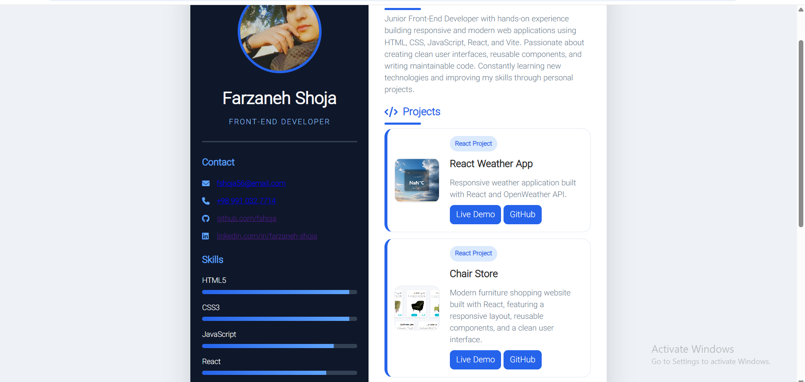

# Personal Front-End Developer Resume

A modern and responsive personal resume website built with HTML and CSS.

## Live Demo

👉 https://fshoja.github.io/resume/

## GitHub Repository

👉 https://github.com/fshoja/resume

## Features

- Responsive Design
- Clean and Modern UI
- Personal Profile
- Skills Section
- Projects Showcase
- Contact Information
- Optimized for PDF Export

## Technologies

- HTML5
- CSS3
- Responsive Design

## Preview



## Getting Started

Clone the repository:

```bash
git clone https://github.com/fshoja/resume.git
```

Open `index.html` in your browser.

## Author

**Farzaneh Shoja**

- GitHub: https://github.com/fshoja
- LinkedIn: https://www.linkedin.com/in/farzaneh-shoja

## License

This project is licensed under the MIT License.